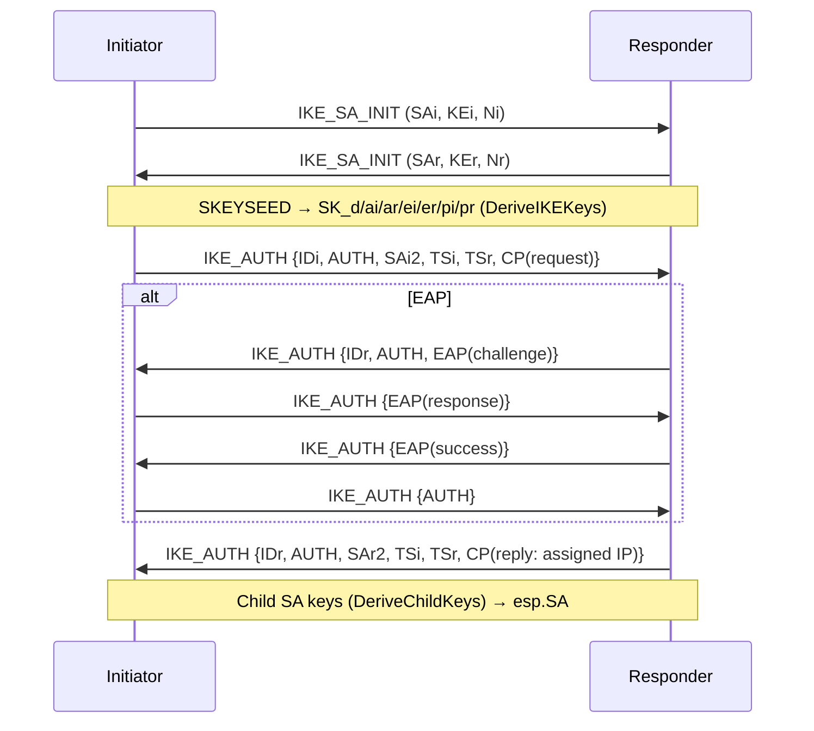
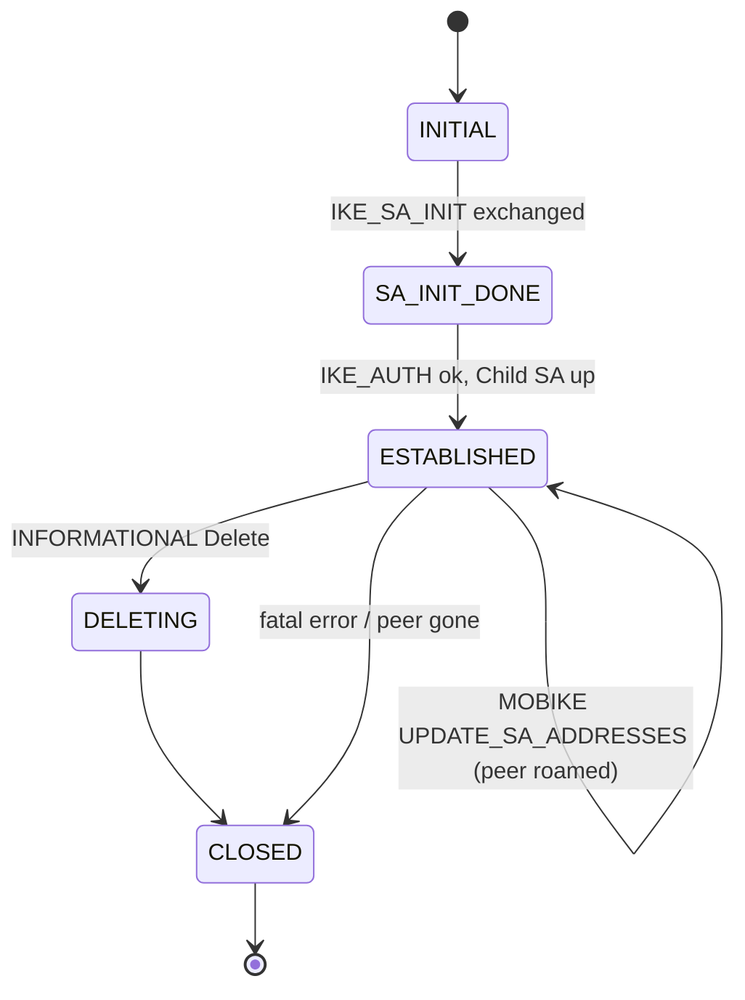

# internal/ikev2/ike

The IKEv2 control plane: the `IKE_SA_INIT` + `IKE_AUTH` handshake (PSK and
EAP-MSCHAPv2), the key schedule, Child-SA negotiation, and the `Client`/`Server`
session drivers. It sits on [`payload`](../payload) (wire format),
[`transform`](../transform) (algorithm lookup), [`eap`](../eap) (username/password
auth), and produces [`esp`](../esp) SAs for the data path.

## Specifications

- [RFC 7296](https://www.rfc-editor.org/rfc/rfc7296) — IKEv2 (exchanges, key derivation §2.14/§2.17, AUTH §2.15).
- [RFC 3947](https://www.rfc-editor.org/rfc/rfc3947) / [RFC 3948](https://www.rfc-editor.org/rfc/rfc3948) — NAT-T detection and UDP-encapsulated ESP.
- [RFC 7296 §3.15](https://www.rfc-editor.org/rfc/rfc7296#section-3.15) — Configuration payload (address assignment).
- [RFC 4555](https://www.rfc-editor.org/rfc/rfc4555) — MOBIKE (address agility for a roaming peer).
- [RFC 7383](https://www.rfc-editor.org/rfc/rfc7383) — IKEv2 fragmentation (inbound SKF reassembly).
- [RFC 7427](https://www.rfc-editor.org/rfc/rfc7427) — IKEv2 signature authentication (the Digital Signature AUTH method 14).

## Handshake and SA lifecycle

Two round trips bring an SA up: `IKE_SA_INIT` negotiates crypto and does the DH
exchange; `IKE_AUTH` (encrypted under the freshly derived keys) proves identity
and negotiates the first Child SA. EAP inserts extra `IKE_AUTH` round trips.

The `SAState` lifecycle:

## API surface

- **Session drivers** — `Client`/`NewClient(ClientConfig)` → `ClientResult`;
  `Server`/`NewServer(Config)`. Both speak all three auth methods (PSK, EAP, certificate).
- **Key schedule** — `DeriveIKEKeys(...) (skeyseed, SAKeys)`,
  `DeriveChildKeys(...)`, `AuthOctets(...)`, `PSKAuth(...)`. `SAKeys` holds
  `SK_d/ai/ar/ei/er/pi/pr`.
- **Suite selection** — `SelectIKESuite`, `SelectESPSuite`,
  `DefaultIKEProposal`, `DefaultESPProposal`, `Suite`, `ESPSuite`.
- **Child SA / data path** — `ChildSA`, `BuildESPSA(*ChildSA) (*esp.SA, error)`;
  `DataPath` interface with `PumpDataPath`/`NewPumpDataPath` wiring the SA to
  [`dataplane`](../../../dataplane).
- **Identity** — `FQDNIdentity`, `IPIdentity`.
- **Errors/state** — `ErrAuthFailed`, `SAState`.

## Implementation notes & caveats

- **`IKE_AUTH` is encrypted, `IKE_SA_INIT` is not.** The AUTH payload signs the
  first message plus the peer's nonce plus `SK_p` (`AuthOctets`); getting the
  signed-octets construction byte-exact is what interoperates with strongSwan.
- **PSK vs EAP diverge only after SA_INIT.** EAP adds round trips carried by
  [`eap`](../eap); the initiator's final AUTH in the EAP flow is keyed from the
  EAP MSK, not the PSK.
- **Certificate auth signs the same octets PSK MACs.** With a certificate
  (`ClientConfig.ClientCert` / `Config.ServerCert`, both `*tls.Certificate`) the
  AUTH payload is a signature over the RFC 7296 §2.15 signed octets rather than
  a `prf`-based MAC. The preferred method is the RFC 7427 Digital Signature
  (method 14): the AUTH payload carries a one-octet ASN.1 length, a DER
  `AlgorithmIdentifier` (e.g. `ecdsa-with-SHA256`), then the signature; both ends
  exchange `SIGNATURE_HASH_ALGORITHMS` in `IKE_SA_INIT` to agree on the hash. A
  peer that offers no `SIGNATURE_HASH_ALGORITHMS` gets the legacy RSA method (1).
  Each side presents its chain in `CERT` payloads (prompted by a `CERTREQ`),
  verifies the peer's chain to a configured CA (`CARoots` / `ClientCAs`), and
  binds the certificate to the peer's `IDi`/`IDr` (SAN or DER-DN) so a trusted
  certificate cannot impersonate a different identity. `certauth.go` holds the
  signature schemes and trust logic; the wire flow is a single round trip like
  PSK. This is what interoperates with strongSwan `pubkey` auth and native
  certificate clients. The classic per-curve ECDSA methods (9/10/11) and RSA-PSS
  are not produced.
- **Dual-stack config mode: one Child SA carries IPv4 and IPv6.** The server's
  `AssignAddr` returns an `Assignment` that may hold a v4 address + netmask, a v6
  address + prefix length, or both. `buildCPReply` emits `INTERNAL_IP4_ADDRESS`/
  `_NETMASK` and, for a v6 assignment, `INTERNAL_IP6_ADDRESS` (16 address octets
  followed by a 1-octet prefix length, RFC 7296 3.15.1 — not the v4 address/mask
  split). The client requests both families and accepts an assignment in either.
  Both ends offer v4+v6 traffic selectors (`allTrafficV4`/`allTrafficV6`), and the
  data path selects the ESP next-header from each inner packet's version nibble
  (4 or 41), so a single Child SA moves both families. The *outer* transport
  stays IPv4 NAT-T; an IPv6 ESP underlay is out of scope.
- **NAT-T floats to UDP/4500 and forces UDP-encap of ESP.** The non-ESP marker
  disambiguates IKE from ESP on the shared 4500 socket; the [`esp`](../esp) path
  assumes this encapsulation.
- **`BuildESPSA` builds the data-path `ESPCrypter` once per SA** — never per
  packet. Reuse the returned `*esp.SA`; rebuilding it would reintroduce the
  per-packet allocations the data-plane benchmarks were tuned to remove.
- **MOBIKE (RFC 4555) is negotiated with `MOBIKE_SUPPORTED` in `IKE_AUTH`.** A
  roaming peer then sends a protected `UPDATE_SA_ADDRESSES` INFORMATIONAL from
  its new address; the responder relocates the SA to the packet's *observed*
  source (never a claimed one — a NAT may have rewritten it), re-runs NAT
  detection, and repoints every Child SA's ESP return address (`PumpDataPath`
  gets an immediate `UpdatePeerAddr`, ahead of the first inbound ESP from the
  new address). `COOKIE2` return-routability probes are echoed verbatim
  (§3.7). The initiator drives its own move with `Client.Roam`, which rebinds
  the NAT-T socket and runs the exchange; `Client.MobikeEnabled` reports
  whether the server agreed. This mirrors kernel/strongSwan behaviour, so a
  native macOS/Windows IKEv2 client keeps its tunnel across a network change
  rather than re-handshaking.
- **IKE fragmentation (RFC 7383) is reassemble-only.** Both ends advertise
  `IKE_FRAGMENTATION_SUPPORTED` in `IKE_SA_INIT`; once negotiated, a peer may
  deliver a large protected message (a certificate-bearing `IKE_AUTH`, or a peer
  set to `fragmentation=force`) as independently encrypted-and-authenticated
  `SKF` fragments, which `fragReassembler` verifies one at a time and stitches
  back into the original inner-payload chain. veepin *never fragments its own
  output* — its PSK/EAP messages are always small — which RFC 7383 §2.5.1
  explicitly permits. Reassembly is bounded (`maxFragments`,
  `maxReassembledBytes`, a TTL) since it buffers peer-supplied state; duplicate
  and out-of-order fragments are handled. The `SK`/`SKF` decrypt and RFC 7296
  de-padding are shared (`openSK`/`stripRFC7296Pad`), so a fragment opens exactly
  like a whole message minus the reassembly.
- **Client liveness and Child SA rekey ride the post-handshake control channel.**
  Once the data path owns the socket, the client can no longer read IKE responses
  inline, so `Attach` switches it to a delivered-inbox mode and the data-path
  loop feeds received IKE datagrams in via `Deliver`. `SendDPD` (an empty
  `INFORMATIONAL` the peer must answer) is the liveness probe the `client`
  monitor drives; `RekeyChild` runs a `CREATE_CHILD_SA` before the ESP SA's soft
  lifetime, deriving fresh keys the same way the handshake does and returning them
  as a `ClientResult` the session swaps into the data path (new SA installed
  before the old is deleted, so no packet is ever without an SA). `exchMu`
  serializes DPD, rekey and MOBIKE roam so their message IDs never interleave.
- **IKE SA rekey (RFC 7296 2.18) rotates the control channel itself.**
  `RekeyIKE` runs a `CREATE_CHILD_SA` carrying an *IKE* proposal, a fresh
  `KEi`/nonce and a new initiator SPI; unlike a Child rekey it does a full
  Diffie-Hellman exchange, so the replacement SA's `SK_*` keys have forward
  secrecy from the old ones (`SKEYSEED = prf(SK_d(old), g^ir(new) | Ni | Nr)`,
  then the standard `prf+` over the new SPIs). The new IKE SA *inherits every
  Child SA unchanged* — their ESP keys are not re-derived — so the data path
  never pauses: only the IKE SPIs and control keys rotate, and message IDs reset
  to zero on the new SA. The initiator installs the new SA, deletes the old one
  with an `INFORMATIONAL{D(IKE)}`, then swaps its own SPIs/keys over; the
  responder migrates the children across and empties the old SA (clearing its
  `ClientIP` so the imminent delete neither tears down the inherited ESP data
  paths nor releases the assigned address). Like DPD and Child rekey it holds
  `exchMu`, so the whole make-before-break sequence is atomic against every
  other initiator exchange. The `SAState` diagram's `ESTABLISHED -> ESTABLISHED`
  self-loop now covers this rotation too, not just a MOBIKE address update.
